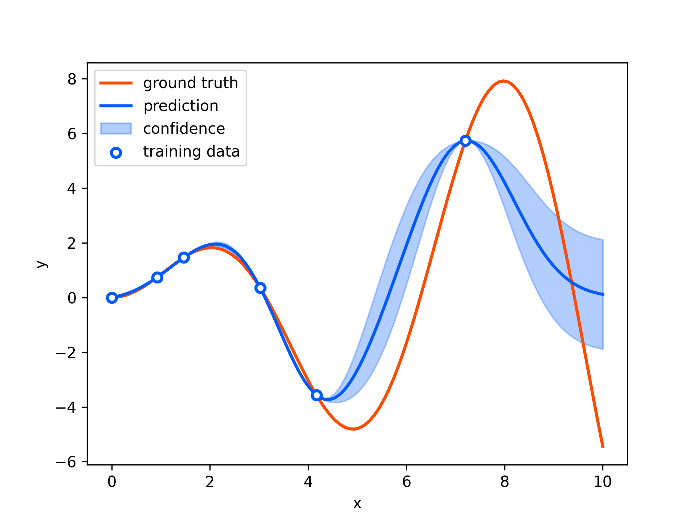
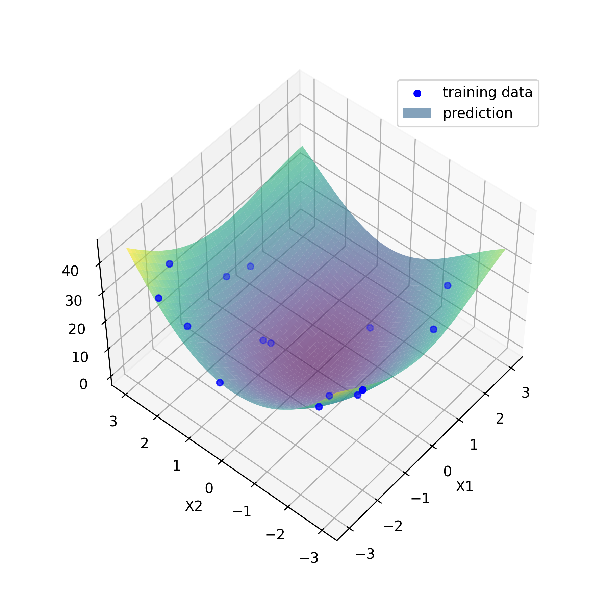

[](https://opensource.org/licenses/MIT)
[](https://rye.astral.sh)

# Gaussian Process

## Dependency

- [python](https://www.python.org/)
  - version 3.10 or higher is recommended.

- [rye](https://rye.astral.sh/)
  - seting up python environment easily and safely.
  - only `numpy`, `matplotlib`, `notebook` are needed to run all scripts in this repository.

## Setup
```sh
git clone https://github.com/MizuhoAOKI/gaussian_process.git
cd gaussian_process
rye sync
```

## Usage

### Gaussian Process Regression

```sh
cd gaussian_process
rye run jupyter notebook notebooks/gp_regression_1d.ipynb
```




```sh
cd gaussian_process
rye run jupyter notebook notebooks/gp_regression_2d.ipynb
```



### Bayesian Optimization

```sh
cd gaussian_process
rye run jupyter notebook notebooks/bayesian_optimization_1d.ipynb
```

https://github.com/MizuhoAOKI/gaussian_process/assets/63337525/36b2d534-8d9f-4a5e-b26d-dc41e0032590

```sh
cd gaussian_process
rye run jupyter notebook notebooks/bayesian_optimization_2d.ipynb
```

https://github.com/user-attachments/assets/6e01d71f-f5d6-4ca8-90a3-6792bac1da56

```sh
cd gaussian_process
rye run jupyter notebook notebooks/bayesian_optimization_path_tracking.ipynb
```

https://github.com/user-attachments/assets/6d2cbb48-3d44-46c5-ba76-3fc29aa1ca1d
